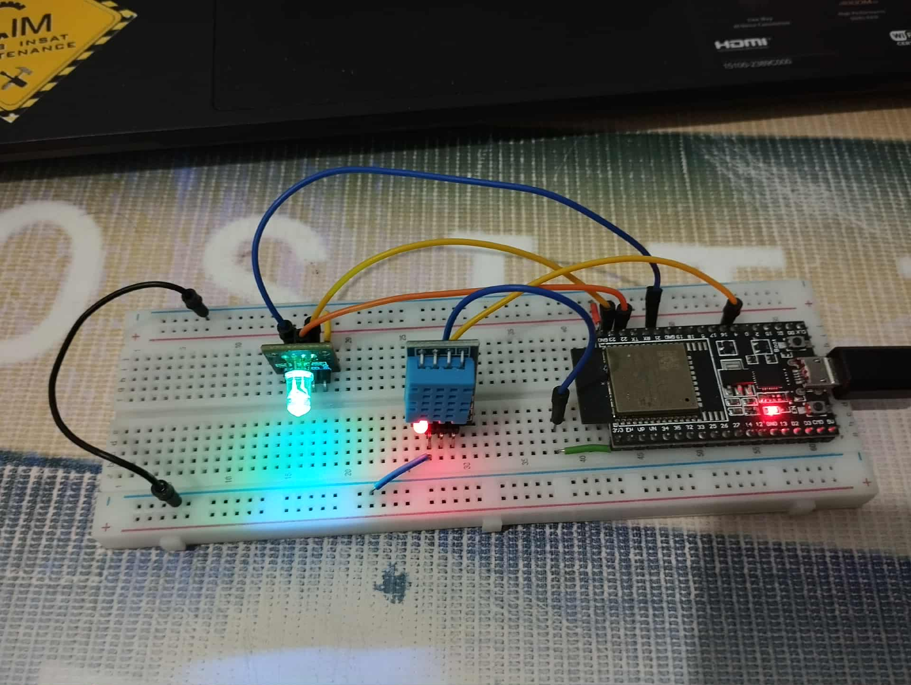

# 🌡️ ESP32 Smart Environment Monitor

> A comprehensive IoT solution for environmental monitoring with web-based configuration and real-time data visualization.

---

## 📹 Demo Video

[Link to Demo Video (Placeholder)]

---

## 🎯 Project Overview

This project implements an ESP32-based smart environment monitor featuring a modern web interface. The system seamlessly integrates multiple functionalities to provide a robust environmental monitoring solution with intuitive configuration capabilities.

**Core Technologies:**
- ESP32 microcontroller
- DHT11 temperature & humidity sensor
- FreeRTOS for concurrent task management
- HTTP server with responsive web UI
- Non-volatile storage for persistent configuration

---

## ✨ Features

| Feature | Description |
|---------|-------------|
| 🚦 **RGB LED Status** | Visual feedback for device operational states |
| 📡 **WiFi Connectivity** | Dual-mode AP/STA for flexible network access |
| 🌐 **HTTP Server** | Full-featured web interface for monitoring and control |
| 🌡️ **DHT11 Sensor** | Real-time temperature and humidity readings |
| 💾 **NVS Storage** | Persistent WiFi credentials and configuration |
| 🔘 **WiFi Reset Button** | Hardware interrupt-driven credential reset |
| ⏰ **SNTP Sync** | Network time synchronization for accurate timestamps |
| 🔄 **OTA Updates** | Remote firmware updates via web interface |

---

## 📋 Table of Contents

- [Demo Video](#-demo-video)
- [Project Overview](#-project-overview)
- [Features](#-features)
- [Circuit Diagram](#-circuit-diagram)
- [Setup and Installation](#-setup-and-installation)
- [Module Explanations](#-module-explanations)
- [Contributing](#-contributing)
- [License](#-license)

---

## 🔌 Circuit Diagram



---

## 🚀 Setup and Installation

### Prerequisites

- ESP-IDF framework installed
- ESP32 development board
- DHT11 sensor
- RGB LED (common cathode)
- Push button for WiFi reset

### Clone the Repository

```bash
git clone https://github.com/yourusername/esp32-smart-environment-monitor.git
cd esp32-smart-environment-monitor
```

### Configuration

1. Set your ESP32 target:
   ```bash
   idf.py set-target esp32
   ```

2. Configure the project:
   ```bash
   idf.py menuconfig
   ```

3. Build the project:
   ```bash
   idf.py build
   ```

4. Flash to your ESP32:
   ```bash
   idf.py -p PORT flash monitor
   ```
   Replace `PORT` with your ESP32's serial port (e.g., `/dev/ttyUSB0` or `COM3`)

### Initial Setup

1. **Power on the ESP32** - The device will start in AP mode
2. **Connect to the ESP32's Access Point** using the credentials in `wifi_app.h`
3. **Open a web browser** and navigate to the ESP32's IP address
4. **Configure your WiFi credentials** through the web interface
5. **Monitor the RGB LED** for connection status

---

## 📚 Module Explanations

### 🚦 RGB LED Status Indicator

**Files:** `rgb_led.c`, `rgb_led.h`

The RGB LED module provides intuitive visual feedback using the ESP32's LEDC peripheral for PWM control.

#### GPIO Pin Configuration

| Component | GPIO Pin |
|-----------|----------|
| Red LED | GPIO 21 |
| Green LED | GPIO 22 |
| Blue LED | GPIO 23 |

#### Status Colors

| Function | Color | RGB Value | Indication |
|----------|-------|-----------|------------|
| `rgb_led_wifi_app_started()` | 💜 Purple/Pink | (255, 102, 255) | WiFi app initialized |
| `rgb_led_http_server_started()` | 💚 Yellow-Green | (204, 255, 51) | HTTP server running |
| `rgb_led_wifi_connected()` | 🟢 Green | (0, 255, 153) | Connected to WiFi |

---

### 📡 WiFi Application

**Files:** `wifi_app.c`, `wifi_app.h`

Manages wireless connectivity with sophisticated dual-mode operation and automatic reconnection.

#### Key Capabilities

- **🔄 Dual Mode Operation** - Simultaneous AP and STA modes (`WIFI_MODE_APSTA`)
- **⚡ Event-Driven Architecture** - FreeRTOS event groups and message queues
- **💾 Persistent Credentials** - NVS integration for credential storage
- **🔁 Auto-Retry Logic** - Configurable connection retry mechanism
- **🌐 Web Integration** - Seamless HTTP server communication

#### Connection Flow

```
┌─────────────────┐
│  System Startup │
└────────┬────────┘
         │
         ▼
┌─────────────────┐
│ Initialize WiFi │
│   & TCP/IP      │
└────────┬────────┘
         │
         ▼
┌─────────────────┐
│  Start AP Mode  │
│  (for config)   │
└────────┬────────┘
         │
         ▼
┌─────────────────┐
│ Load Saved SSID │
│   from NVS      │
└────────┬────────┘
         │
         ▼
┌─────────────────┐
│ Attempt STA     │
│   Connection    │
└────────┬────────┘
         │
         ▼
┌─────────────────┐
│ Start HTTP      │
│    Server       │
└─────────────────┘
```

---

### 🌐 HTTP Server

**Files:** `http_server.c`, `http_server.h`, `index.html`, `app.css`, `app.js`, `jquery-3.3.1.min.js`

A full-featured web server providing an intuitive interface for device configuration and monitoring.

#### Server Architecture

```
┌──────────────┐         ┌──────────────┐
│   Browser    │◄───────►│  HTTP Server │
│   Client     │  HTTP   │   (ESP32)    │
└──────────────┘         └──────┬───────┘
                                │
                    ┌───────────┼───────────┐
                    │           │           │
                    ▼           ▼           ▼
              ┌─────────┐ ┌─────────┐ ┌─────────┐
              │WiFi App │ │RGB LED  │ │ DHT11   │
              └─────────┘ └─────────┘ └─────────┘
```

#### Endpoints & Features

- **📄 Static Content** - HTML, CSS, JavaScript files
- **⚙️ WiFi Configuration** - SSID/password management
- **📊 Real-time Status** - Connection state and sensor data
- **🔄 OTA Updates** - Wireless firmware updates
- **📡 API Communication** - RESTful interface for device control

---

### ⚙️ Tasks Common

**File:** `tasks_common.h`

Defines FreeRTOS task parameters ensuring optimal resource allocation and concurrent execution.

#### Task Configuration Table

| Task Name | Stack Size | Priority | Core | Purpose |
|-----------|------------|----------|------|---------|
| `WIFI_APP_TASK` | 4096 B | 5 | 0 | WiFi management |
| `HTTP_SERVER_TASK` | 8192 B | 4 | 0 | Web server |
| `HTTP_SERVER_MONITOR` | 4096 B | 3 | 0 | Server monitoring |
| `WIFI_RESET_BUTTON_TASK` | 2048 B | 6 | 0 | Button handling |
| `DHT11_TASK` | 4096 B | 5 | 1 | Sensor reading |
| `SNTP_TIME_SYNC_TASK` | 4096 B | 4 | 1 | Time sync |

> **Note:** Tasks are distributed across both cores for optimal performance

---

### 🌡️ DHT11 Sensor & NVS Storage

#### DHT11 Application

**Files:** `DHT11.c`, `DHT11.h`

Interfaces with the DHT11 sensor for environmental monitoring.

**Features:**
- 🌡️ **Temperature Reading** - Ambient temperature in Celsius
- 💧 **Humidity Reading** - Relative humidity percentage
- ✅ **Error Detection** - Checksum validation and timeout handling
- 🔄 **Periodic Updates** - FreeRTOS task-based acquisition
- 📍 **GPIO Configuration** - Default GPIO4 (configurable)

> ⚠️ **Important:** This project uses DHT11 (integer values), not DHT22 (decimal precision)

#### NVS Storage Module

**Files:** `app_nvs.c`, `app_nvs.h`

Provides persistent configuration storage in ESP32 flash memory.

**Capabilities:**
- 💾 **Save Credentials** - WiFi SSID and password
- 📥 **Load on Boot** - Automatic credential retrieval
- 🗑️ **Clear Data** - Reset functionality
- 🔗 **WiFi Integration** - Seamless connectivity management

---

### 🔘 WiFi Reset Button

**Files:** `wifi_reset_button.c`, `wifi_reset_button.h`

Hardware interrupt-driven WiFi credential reset mechanism.

#### Implementation Details

- **📍 GPIO Pin:** GPIO0 (BOOT button on most DevKits)
- **⚡ Trigger:** Negative edge (button press)
- **🧵 Synchronization:** FreeRTOS binary semaphore
- **🔄 Action:** Disconnect and clear saved credentials

#### Operation Flow

```
Button Press → GPIO Interrupt → Semaphore Signal → Task Wakeup → 
Clear NVS → Disconnect WiFi → Return to AP Mode
```

---

### ⏰ SNTP Time Synchronization

**Files:** `sntp_time_sync.c`, `sntp_time_sync.h`

Network time synchronization for accurate timekeeping.

#### Features

- 🌍 **NTP Client** - Connects to public NTP servers
- ⏱️ **Periodic Sync** - Background time updates
- 🌐 **Timezone Support** - Local timezone configuration
- 🔔 **Server Notification** - Time init callbacks
- 📅 **Formatted Output** - Human-readable time strings

#### Configuration

```c
// Default NTP server
pool.ntp.org

// Example timezone (CET)
CET-1CEST,M3.5.0,M10.5.0/3
```

---

### 🔄 OTA (Over-The-Air) Firmware Updates

**Files:** `http_server.c` (OTA handlers)

Enable wireless firmware updates without physical access to the device.

#### Features

- 📦 **Web-Based Upload** - Update firmware through the web interface
- ✅ **Validation** - Automatic firmware integrity verification
- 🔐 **Secure Partitioning** - Uses ESP32's dual partition system
- 🔄 **Automatic Reboot** - Device restarts after successful update
- 📊 **Status Feedback** - Real-time update progress and status

#### Update Process Flow

```
┌─────────────────┐
│  User selects   │
│  .bin file via  │
│  web interface  │
└────────┬────────┘
         │
         ▼
┌─────────────────┐
│ HTTP POST to    │
│  /OTAupdate     │
└────────┬────────┘
         │
         ▼
┌─────────────────┐
│ Validate & get  │
│ next partition  │
└────────┬────────┘
         │
         ▼
┌─────────────────┐
│ Write firmware  │
│ to flash (1KB   │
│ chunks)         │
└────────┬────────┘
         │
         ▼
┌─────────────────┐
│ Set boot        │
│ partition       │
└────────┬────────┘
         │
         ▼
┌─────────────────┐
│ 8-second timer  │
│ then reboot     │
└─────────────────┘
```

#### API Endpoints

| Endpoint | Method | Purpose |
|----------|--------|---------|
| `/OTAupdate` | POST | Upload and flash new firmware |
| `/OTAstatus` | POST | Get update status and build info |

#### Status Codes

- **`OTA_UPDATE_PENDING`** - Waiting for firmware upload
- **`OTA_UPDATE_SUCCESSFUL`** - Firmware flashed successfully, rebooting
- **`OTA_UPDATE_FAILED`** - Update failed, device remains on current firmware

#### Build Information

The system provides compile-time metadata for verification:
- **Compile Time** - Build timestamp
- **Compile Date** - Build date
- **Firmware Version** - Current running version

> ⚠️ **Important:** Ensure the new firmware is compatible with your hardware configuration. An invalid firmware can brick the device, though ESP32's dual partition system provides recovery options.

---

## 🤝 Contributing

We welcome contributions! Here's how you can help:

1. 🍴 Fork the repository
2. 🌿 Create a feature branch (`git checkout -b feature/AmazingFeature`)
3. 💾 Commit your changes (`git commit -m 'Add some AmazingFeature'`)
4. 📤 Push to the branch (`git push origin feature/AmazingFeature`)
5. 🎉 Open a Pull Request

---

## 📄 License

This project is licensed under the **MIT License** - see the [LICENSE](LICENSE) file for details.

---

<div align="center">

**Made with ❤️ for the IoT Community**

⭐ Star this repo if you find it helpful!

</div>
